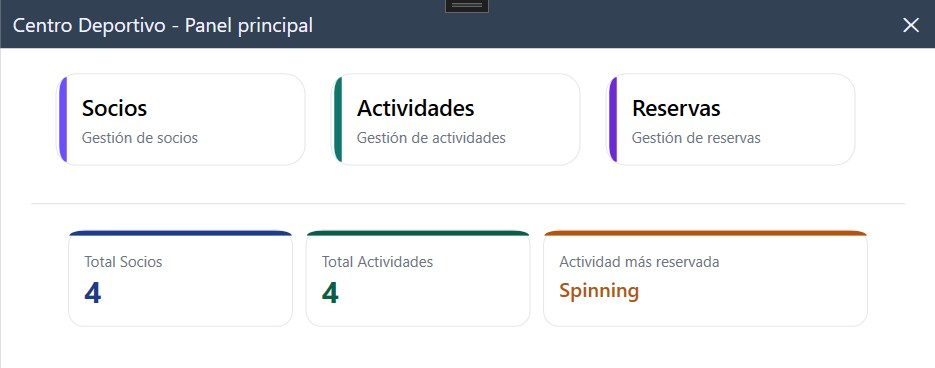
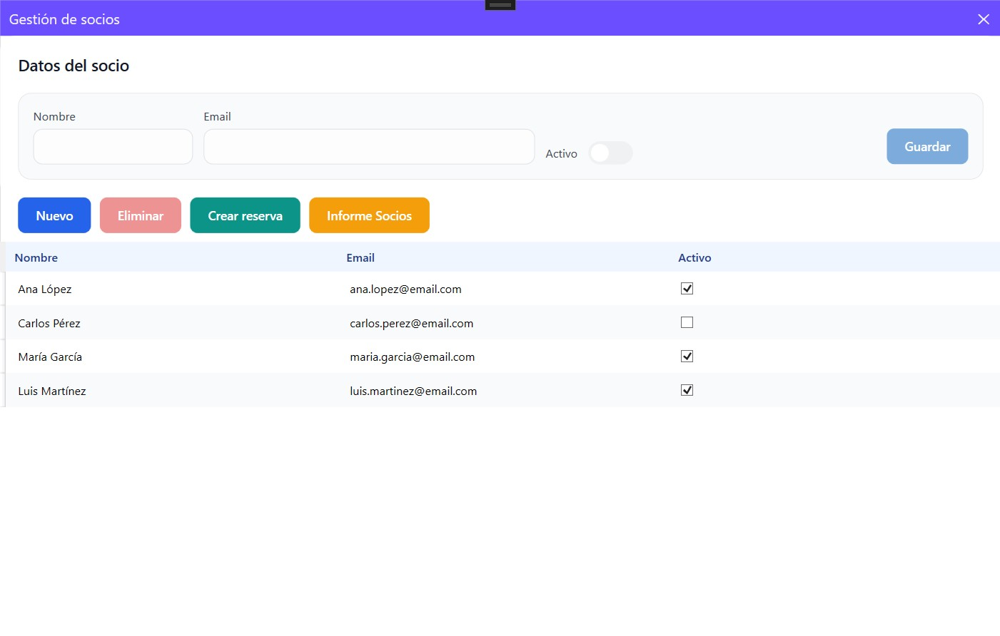
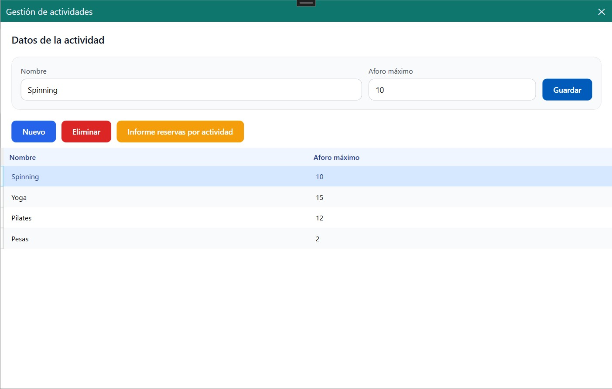
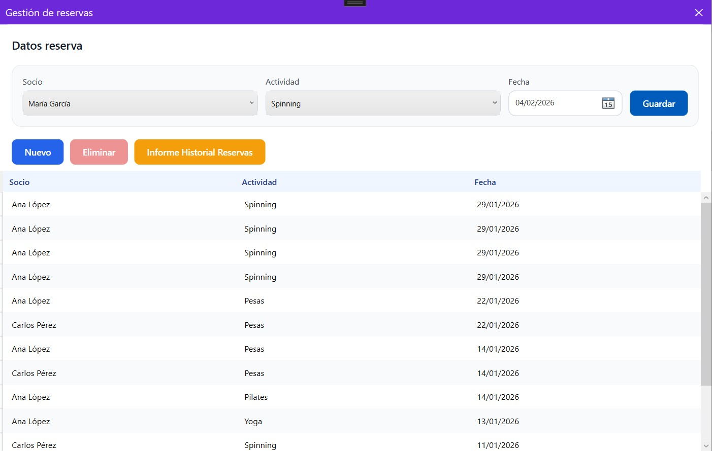
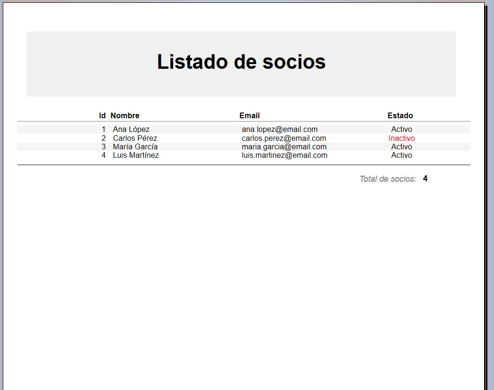

# 🏋️ Centro Deportivo - Sistema de Gestión


Aplicación de escritorio para la gestión integral de un centro deportivo, desarrollada con WPF siguiendo el patrón arquitectónico MVVM.

---

## 📋 Tabla de Contenidos

- [Características](#-características)
- [Tecnologías Utilizadas](#-tecnologías-utilizadas)
- [Arquitectura del Proyecto](#-arquitectura-del-proyecto)
- [Requisitos del Sistema](#-requisitos-del-sistema)
- [Instalación](#-instalación)
- [Configuración de la Base de Datos](#-configuración-de-la-base-de-datos)
- [Uso de la Aplicación](#-uso-de-la-aplicación)
- [Estructura del Proyecto](#-estructura-del-proyecto)
- [Capturas de Pantalla](#-capturas-de-pantalla)
- [Documentación Técnica](#-documentación-técnica)
- [Tests](#-tests)
- [Contribuir](#-contribuir)
- [Licencia](#-licencia)
- [Autor](#-autor)

---

## ✨ Características

### Funcionalidades Principales

- ✅ **Gestión de Socios**
  - Alta, baja y modificación de socios
  - Activación/desactivación de socios
  - Validación de datos (email, campos obligatorios)
  - Generación de informes de socios

- ✅ **Gestión de Actividades**
  - Crear y administrar actividades deportivas
  - Control de aforo máximo por actividad
  - Informe de reservas por actividad

- ✅ **Sistema de Reservas**
  - Reserva de actividades por fecha
  - Validación de aforo disponible
  - Control de fechas (no permite reservas en el pasado)
  - Preselección de socio/actividad desde otras ventanas
  - Historial completo de reservas

- ✅ **Generación de Informes**
  - Informe maestro de socios
  - Informe de reservas por actividad
  - Historial completo de reservas
  - Exportación a PDF
  - Visualización e impresión de informes

- ✅ **Dashboard Principal**
  - Estadísticas en tiempo real
  - Total de socios activos
  - Total de actividades disponibles
  - Actividad más reservada

---

## 🛠️ Tecnologías Utilizadas

### Framework y Lenguajes
- **C# 7.3** - Lenguaje de programación principal
- **.NET Framework 4.8** - Framework de desarrollo
- **WPF (Windows Presentation Foundation)** - Interfaz gráfica de usuario
- **XAML** - Lenguaje de marcado para las vistas

### Arquitectura y Patrones
- **MVVM (Model-View-ViewModel)** - Patrón arquitectónico
- **Repository Pattern** - Patrón para acceso a datos
- **ICommand** - Patrón Command con RelayCommand

### Acceso a Datos
- **Entity Framework 6.x** - ORM para acceso a base de datos
- **SQL Server** - Motor de base de datos
- **Database First** - Enfoque de desarrollo

### Generación de Informes
- **Crystal Reports** - Generación de informes PDF
- **Typed DataSets** - Conjuntos de datos tipados

### Testing
- **MSTest / NUnit** - Framework de pruebas unitarias

---

## 🏗️ Arquitectura del Proyecto

La aplicación sigue el patrón **MVVM** con una clara separación de responsabilidades en capas:

```
┌──────────────────────────────────────┐
│         CAPA DE PRESENTACIÓN         │
│      (CentroDeportivo.View)          │
│         Views XAML + WPF             │
└──────────────────┬───────────────────┘
                   │ DataBinding
┌──────────────────▼───────────────────┐
│      CAPA DE LÓGICA DE NEGOCIO       │
│    (CentroDeportivo.ViewModel)       │
│     ViewModels + Commands            │
└──────────────────┬───────────────────┘
                   │ Repository
┌──────────────────▼───────────────────┐
│       CAPA DE ACCESO A DATOS         │
│     (centroDeportivo.Model)          │
│   Entities + Repositories + EF       │
└──────────────────┬───────────────────┘
                   │ SQL
┌──────────────────▼───────────────────┐
│          BASE DE DATOS               │
│          SQL Server                  │
└──────────────────────────────────────┘
```

### Proyectos de la Solución

| Proyecto | Tipo | Descripción |
|----------|------|-------------|
| **centroDeportivo.Model** | Biblioteca de Clases | Entidades, repositorios y contexto de EF |
| **CentroDeportivo.ViewModel** | Biblioteca de Clases | ViewModels, comandos y lógica de presentación |
| **CentroDeportivo.View** | Aplicación WPF | Ventanas, vistas y recursos visuales |
| **CentroDeportivo.Reports** | Biblioteca de Clases | Definición de informes Crystal Reports |
| **CentroDeportivo.ReportsView** | Biblioteca WPF | Visor de informes |
| **CentroDeportivo.test** | Proyecto de Pruebas | Tests unitarios |

---

## 💻 Requisitos del Sistema

### Software Necesario
- Windows 10 o superior
- .NET Framework 4.8 Runtime
- SQL Server 2016 o superior (LocalDB, Express, Standard o Enterprise)
- Crystal Reports Runtime (incluido en la instalación)

### Para Desarrollo
- Visual Studio 2019 o superior
- SQL Server Management Studio (SSMS)
- Crystal Reports para Visual Studio
- Entity Framework 6.x

---

## 📥 Instalación

### 1. Clonar el Repositorio

```bash
git clone https://github.com/juaruifra/centroDeportivoInformes.git
cd centroDeportivoInformes
```

### 2. Abrir la Solución

Abrir el archivo `CentroDeportivo.sln` en Visual Studio.

### 3. Restaurar Paquetes NuGet

Visual Studio restaurará automáticamente los paquetes necesarios. Si no:

```powershell
nuget restore
```

### 4. Configurar la Cadena de Conexión

Editar el archivo `App.config` en el proyecto `CentroDeportivo.View`:

### 5. Compilar y Ejecutar

Presionar `F5` o hacer clic en **Iniciar** en Visual Studio.

---

## 🗄️ Configuración de la Base de Datos

### Estructura de la Base de Datos

La base de datos consta de 3 tablas principales:

#### Tabla: Socios
```sql
CREATE TABLE Socios (
    Id INT PRIMARY KEY IDENTITY(1,1),
    Nombre NVARCHAR(100) NOT NULL,
    Email NVARCHAR(100) NOT NULL,
    Activo BIT NOT NULL DEFAULT 1
);
```

#### Tabla: Actividades
```sql
CREATE TABLE Actividades (
    Id INT PRIMARY KEY IDENTITY(1,1),
    Nombre NVARCHAR(100) NOT NULL,
    AforoMaximo INT NOT NULL CHECK(AforoMaximo > 0)
);
```

#### Tabla: Reservas
```sql
CREATE TABLE Reservas (
    Id INT PRIMARY KEY IDENTITY(1,1),
    SocioId INT NOT NULL FOREIGN KEY REFERENCES Socios(Id) ON DELETE CASCADE,
    ActividadId INT NOT NULL FOREIGN KEY REFERENCES Actividades(Id) ON DELETE CASCADE,
    Fecha DATETIME NOT NULL
);
```

### Diagrama Entidad-Relación

```
┌─────────────┐         ┌──────────────┐         ┌──────────────────┐
│   Socios    │         │   Reservas   │         │   Actividades    │
├─────────────┤         ├──────────────┤         ├──────────────────┤
│ Id (PK)     │────┐    │ Id (PK)      │    ┌────│ Id (PK)          │
│ Nombre      │    └───>│ SocioId (FK) │    │    │ Nombre           │
│ Email       │         │ ActividadId  │────┘    │ AforoMaximo      │
│ Activo      │         │ Fecha        │         └──────────────────┘
└─────────────┘         └──────────────┘
     1                        *  *                        1
```

### Script de Datos de Prueba

```sql
-- Insertar socios de prueba
INSERT INTO Socios (Nombre, Email, Activo) VALUES
('Juan Pérez', 'juan.perez@email.com', 1),
('María García', 'maria.garcia@email.com', 1),
('Carlos López', 'carlos.lopez@email.com', 1);

-- Insertar actividades de prueba
INSERT INTO Actividades (Nombre, AforoMaximo) VALUES
('Yoga', 15),
('Spinning', 20),
('Pilates', 12),
('CrossFit', 10);

-- Insertar reservas de prueba
INSERT INTO Reservas (SocioId, ActividadId, Fecha) VALUES
(1, 1, GETDATE()),
(1, 2, GETDATE() + 1),
(2, 1, GETDATE()),
(3, 3, GETDATE() + 2);
```

---

## 🚀 Uso de la Aplicación

### Inicio de la Aplicación

Al iniciar la aplicación, se muestra el **Dashboard Principal** con las estadísticas del centro:

- Total de socios registrados
- Total de actividades disponibles
- Actividad más reservada

### Gestionar Socios

1. Hacer clic en **"Gestión de Socios"** desde el menú principal
2. La ventana muestra la lista de socios existentes
3. Para **crear un nuevo socio**:
   - Clic en **"Nuevo"**
   - Rellenar: Nombre, Email, Estado (Activo)
   - Clic en **"Guardar"**
4. Para **editar un socio**:
   - Seleccionar el socio en la tabla
   - Modificar los datos
   - Clic en **"Guardar"**
5. Para **eliminar un socio**:
   - Seleccionar el socio en la tabla
   - Clic en **"Eliminar"**
   - Confirmar la eliminación

### Gestionar Actividades

1. Hacer clic en **"Gestión de Actividades"** desde el menú principal
2. Flujo similar a la gestión de socios
3. Campos: Nombre de la actividad y Aforo máximo

### Crear Reservas

1. Hacer clic en **"Gestión de Reservas"** desde el menú principal
2. Clic en **"Nueva"** para crear una reserva
3. Seleccionar:
   - **Socio** del ComboBox
   - **Actividad** del ComboBox
   - **Fecha** del DatePicker
4. Clic en **"Guardar"**
5. El sistema validará:
   - Que todos los campos estén completos
   - Que la fecha no sea anterior a hoy
   - Que haya plazas disponibles en la actividad

### Generar Informes

#### Informe de Socios
1. Desde la ventana de socios, clic en **"Informe de Socios"**
2. Se abre el visor con el listado completo de socios

#### Informe de Reservas por Actividad
1. Desde la ventana de actividades, seleccionar una actividad
2. Clic en **"Informe de Reservas"**
3. Se muestra el informe filtrado para esa actividad

#### Historial de Reservas
1. Desde la ventana de reservas, clic en **"Informe Historial"**
2. Se muestra el listado completo de todas las reservas

### Funcionalidades Avanzadas

#### Crear Reserva desde Socios
- Desde la ventana de socios, seleccionar un socio
- Clic en **"Crear Reserva"**
- Se abre la ventana de reservas con el socio preseleccionado

---

## 📁 Estructura del Proyecto

```
centroDeportivoInformes/
│
├── centroDeportivo.Model/              # Capa de datos
│   ├── Socios.cs                       # Entidad Socios
│   ├── Actividades.cs                  # Entidad Actividades
│   ├── Reservas.cs                     # Entidad Reservas
│   ├── RepositoryBase.cs               # Clase base para repositorios
│   ├── SociosRepository.cs             # Repositorio de socios
│   ├── ActividadesRepository.cs        # Repositorio de actividades
│   ├── ReservasRepository.cs           # Repositorio de reservas
│   └── dbCentroDeportivo.edmx          # Modelo Entity Framework
│
├── CentroDeportivo.ViewModel/          # Capa de lógica
│   ├── BaseViewModel.cs                # Clase base con INotifyPropertyChanged
│   ├── RelayCommand.cs                 # Implementación de ICommand
│   ├── MenuPrincipalViewModel.cs       # ViewModel del dashboard
│   ├── SociosViewModel.cs              # ViewModel de socios
│   ├── ActividadesViewModel.cs         # ViewModel de actividades
│   └── ReservasViewModel.cs            # ViewModel de reservas
│
├── CentroDeportivo.View/               # Capa de presentación
│   ├── MenuWindow.xaml                 # Ventana principal
│   ├── SociosWindow.xaml               # Ventana de socios
│   ├── ActividadesWindow.xaml          # Ventana de actividades
│   ├── ReservasWindow.xaml             # Ventana de reservas
│   ├── styles.xaml                     # Estilos globales
│   └── App.xaml                        # Configuración de la aplicación
│
├── CentroDeportivo.Reports/            # Capa de informes
│   ├── InformeMaestroSocios.rpt        # Informe Crystal Reports
│   ├── InformeReservasPorActividad.rpt # Informe de reservas
│   ├── InformeHistorialReservas.rpt    # Informe de historial
│   ├── SociosReportBuilder.cs          # Constructor de informe socios
│   ├── ReservasPorActividadReportBuilder.cs
│   ├── HistorialReservasPorSocioReportBuilder.cs
│   └── ReportType.cs                   # Enumeración de tipos de informe
│
├── CentroDeportivo.ReportsView/        # Visor de informes
│   └── Window1.xaml                    # Ventana con CrystalReportViewer
│
├── CentroDeportivo.test/               # Tests unitarios
│   └── Test1.cs                        # Pruebas de validación
│
└── README.md                           # Este archivo
```

---

## 📸 Capturas de Pantalla

### Dashboard Principal

<div align="center">
  
  <p><em>Pantalla principal con estadísticas en tiempo real</em></p>
</div>

### Gestión de Socios
<div align="center">
  
  <p><em>Pantalla gestión de socios</em></p>
</div>

### Gestión de Actividades
<div align="center">
  
  <p><em>Pantalla gestión de actividades</em></p>
</div>

### Sistema de Reservas
<div align="center">
  
  <p><em>Pantalla gestión de reservas</em></p>
</div>

### Informe de Socios
<div align="center">
  
  <p><em>Visualización informe de socios</em></p>
</div>

---
### Conceptos Clave

#### Patrón MVVM
La aplicación implementa MVVM puro:
- **Model**: Entidades de Entity Framework + Repositorios
- **View**: Ventanas XAML con DataBinding
- **ViewModel**: Lógica de presentación + Commands

#### DataBinding Bidireccional
Todas las propiedades del ViewModel implementan `INotifyPropertyChanged`, permitiendo que los cambios se reflejen automáticamente en la interfaz.

#### Repositorios
Los repositorios encapsulan el acceso a datos:
```csharp
public class SociosRepository : RepositoryBase
{
    public List<Socios> GetAll() { ... }
    public void Save(Socios socio) { ... }
    public void Delete(Socios socio) { ... }
}
```

#### RelayCommand
Implementación simple de `ICommand`:
```csharp
GuardarCommand = new RelayCommand(
    execute: Guardar,
    canExecute: PuedeGuardar
);
```

---

## 🧪 Tests

El proyecto incluye tests en `CentroDeportivo.test`:

### Ejecutar Tests

Desde Visual Studio:
Usar el explorador de pruebas (Test Explorer)

Desde la línea de comandos:
```powershell
dotnet test
```

### Cobertura de Tests

Los tests cubren:
- ✅ Validaciones de campos obligatorios
- ✅ Validación de formato de email
- ✅ Validación de aforo máximo
- ✅ Validación de fechas
- ✅ Lógica de reservas

---

## 🤝 Contribuir

Las contribuciones son bienvenidas. Para contribuir:

1. Hacer fork del repositorio
2. Crear una rama para tu feature (`git checkout -b feature/NuevaFuncionalidad`)
3. Commit de los cambios (`git commit -m 'Añadir nueva funcionalidad'`)
4. Push a la rama (`git push origin feature/NuevaFuncionalidad`)
5. Abrir un Pull Request

### Guía de Estilo

- Seguir las convenciones de C# y .NET
- Usar comentarios XML para documentar métodos públicos
- Mantener la separación de responsabilidades MVVM
- Escribir tests para nuevas funcionalidades
- Comentarios en español con lenguaje claro

---


## 👨‍💻 Autor

**Juan Antonio Ruiz Franco**

- GitHub: [@juaruifra](https://github.com/juaruifra)
- Proyecto: [centroDeportivoInformes](https://github.com/juaruifra/centroDeportivoInformes)

---

## 🙏 Agradecimientos

- Comunidad de WPF y MVVM
- Documentación de Entity Framework
- Crystal Reports para .NET
- Stack Overflow y comunidades de desarrollo

---

## 📝 Notas de Versión

### Versión 1.0.0 (Actual)
- ✅ Sistema completo de gestión de socios
- ✅ Gestión de actividades deportivas
- ✅ Sistema de reservas con validación de aforo
- ✅ Generación de informes PDF
- ✅ Dashboard con estadísticas en tiempo real
- ✅ Validaciones completas en todos los formularios
- ✅ Arquitectura MVVM completa
- ✅ Tests unitarios

---

## ⚙️ Configuración Avanzada

### Cambiar la Base de Datos

Para usar SQL Server

1. Crear la base de datos en SQL Server
2. Ejecutar los scripts de creación de tablas
3. Actualizar el `connectionString` en `App.config`:

```xml
data source=SERVIDOR\INSTANCIA;
initial catalog=CentroDeportivo;
integrated security=True;
```

### Regenerar el Modelo Entity Framework

Si se modifica la base de datos:

1. Click derecho en `dbCentroDeportivo.edmx`
2. **Actualizar modelo desde base de datos...**
3. Seleccionar las tablas modificadas
4. **Finalizar**

---

## 🔧 Solución de Problemas

### Error: No se cargan los informes Crystal Reports

**Solución**: Instalar Crystal Reports Runtime desde [SAP](https://www.sap.com/cmp/td/sap-crystal-reports-visual-studio-net.html)

### Error: No se actualizan los datos en la interfaz

**Solución**: Verificar que las propiedades llamen a `OnPropertyChanged(nameof(Propiedad))`

### Los botones no se habilitan/deshabilitan

**Solución**: Llamar a `Command.RaiseCanExecuteChanged()` cuando cambien las condiciones

---

<div align="center">

**⭐ Si te ha gustado este proyecto, dale una estrella en GitHub ⭐**

</div>
